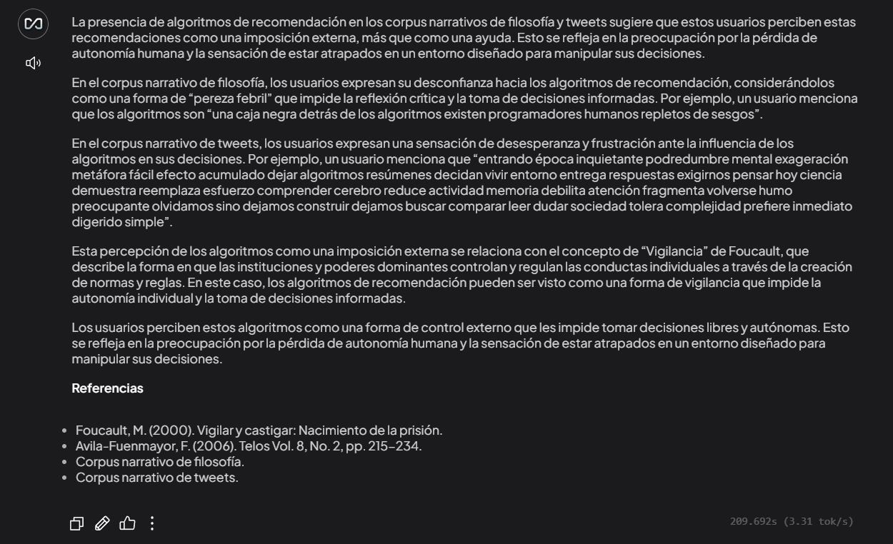

# Creacion de un RAG para responder a preguntas de temas filosoficos y actuales 
Un **RAG** (Retrieval-Augmented Generation o Generación Aumentada por Recuperación) es una técnica de IA que mejora los modelos de lenguaje grandes (LLM) permitiéndoles buscar y usar información externa de documentos para generar respuestas más precisas y contextualmente relevantes, sin necesidad de reentrenarlos constantemente, combinando recuperación de información y generación de texto.

En este caso se nos proporciono un Dataset sintetico con tweets que hablaba sobre dos temas **Generacion z y la crisisi de sentido en la era digital** y **IA y la desaparicion de de la autonomia humana** (Más informacion en *temas.md*).

Aparte de ese Dataset sintetico se recolectaron tweets de personas reales que hablaban sobre los temas (Link de los tweets consultados en *recoleccion/urls.txt*) para obtener datos de opiniones de personas veridicas. 

Tambien se recolectaron pdfs que en su mayoria son simplificados de los temas filosoficos que queremos abarcar(*Articulos/*). 

Entonces, antes de poder pasar esta informacion al sistema que vamos a utilizar para crear nuestro RAG, debemos limpiar estos datos para que esten listos para pasar por el proceso de **embedding**, y asi se puedan crear las relaciones semanticas correspondientes. 

# Proceso de limpieza

1. Eliminacion de duplicados (Este paso solo se aplico al dataset sintetico)
El Dataset sintetico es una coleccion de varios tweets generados de forma artificial, por lo cual queremos asegurarnos de que no haya repetidos para que asi el peso en las relaciones no se vea afectado. Para ello ejecutamos el script *eliminar_duplicados(1).py* que se encarga de esto; este script toma un asrvhico **csv** que es la extencion que estamos usando por defecto para nuestros datasets, y compara la columna de texto de cada una de las filas que representan un tweet y nos devuelve otro csv con los tweets unicos. 

- Nota: Cada script tiene sus respectivos competarios que explican su proposito de forma general y para que sirve cada linea de codigo o funcion. 

2. Limpieza del dataset 
Esta paso se aplico tanto para el dataset sintetico como para el que contiene los tweets que nosotros recolectamos. Este script llamado *limpieza_corpus(2).py* lo que hace es que recibe un csv con y de igual manera toma la columna de texto de cada fila y aplica dos cambios importantes: **normalizacion** y **eliminacion de stopwords**, esto lo que permite es obtener textos mas limpios que al momento de hacerles el embedding le daran mejor contexto a nuestro modelo para que responder. 
Al final devuelve un csv con el texto modificado de cada columna. 

3. Transformacion de los dataset
En este ultimo paso queremos evitar pasarle un csv a nuestro embedder, porque esto dificultaria el proceso, por lo cual a cada fila de nuestro dataset la transformamos en un parrafo narrativo, los cuales guardamos en archivos **txt**, este script *transformar(3).py* recibe los csv y nos devulve archivos de texto, que ya son el resultado final para pasarlo al RAG. Al final se juntaron ambos dataset para generar un **Corpus** general. 

4. Transformacion de los pdfs
A cada pdf se le aplico una "transformacion", primero se eliminaron las hojas que contenian indices, e imagenes y despues se pasaron por un **OCR** que es un proceso que convierte todo el texto disponible del pdf en texto escaneable y editable. Esto se hizo con el fin de que al momento de hacer embedding de cada uno de estos documentos, se puedan recolectar todas las palabras necesarias. 

# Creacion del RAG
Para crear este RAG se utilizo **Anything LLM**, el cual proporciona todas la herramientas necesarias para llevarlo acabo, desde una base de datos vectorial hasta la seleccion de modelos para el embedding. 

Se creo un nuevo Workspace y se decidio utilizar como modelo base **llama3 8b**, y como embedder se utilizo **jina** el cual fue elegido porque es un modelo especializado en hacer embedding de textos en español. 

En el workspace se le paso un prompt (*prompt.md*) el cual ayuda a guiar al modelo para que responda de forma adecuada y se selecciono el modo de **query**, esto para que solo responda en base al contexto que le pasemos (El corpus y los pdfs).

Una vez hecha esta configuracion se le pasaron los dataset y pdfs seleccionados para hacer el embedding y se procedio a hacer una pregunta inicial, la cual fue respondida con el contexto proporcionado y el seguimiento deseado, por lo cual se puede decir que el RAG funciona correctamente. 

# Respuestas a preguntas 

- Analiza las menciones sobre algoritmos de recomendación en los corpus narrativos de filosofia y tweets. ¿Los usuarios perciben estas recomendaciones como una ayuda o como una imposición externa? Interpreta esto a través del concepto de ‘Vigilancia’ de Foucault.

**Respuesta:**
La presencia de algoritmos de recomendación en los corpus narrativos de filosofía y tweets sugiere que estos usuarios perciben estas recomendaciones como una imposición externa, más que como una ayuda. Esto se refleja en la preocupación por la pérdida de autonomía humana y la sensación de estar atrapados en un entorno diseñado para manipular sus decisiones.

En el corpus narrativo de filosofía, los usuarios expresan su desconfianza hacia los algoritmos de recomendación, considerándolos como una forma de “pereza febril” que impide la reflexión crítica y la toma de decisiones informadas. Por ejemplo, un usuario menciona que los algoritmos son “una caja negra detrás de los algoritmos existen programadores humanos repletos de sesgos”.

En el corpus narrativo de tweets, los usuarios expresan una sensación de desesperanza y frustración ante la influencia de los algoritmos en sus decisiones. Por ejemplo, un usuario menciona que “entrando época inquietante podredumbre mental exageración metáfora fácil efecto acumulado dejar algoritmos resúmenes decidan vivir entorno entrega respuestas exigirnos pensar hoy ciencia demuestra reemplaza esfuerzo comprender cerebro reduce actividad memoria debilita atención fragmenta volverse humo preocupante olvidamos sino dejamos construir dejamos buscar comparar leer dudar sociedad tolera complejidad prefiere inmediato digerido simple”.

Esta percepción de los algoritmos como una imposición externa se relaciona con el concepto de “Vigilancia” de Foucault, que describe la forma en que las instituciones y poderes dominantes controlan y regulan las conductas individuales a través de la creación de normas y reglas. En este caso, los algoritmos de recomendación pueden ser visto como una forma de vigilancia que impide la autonomía individual y la toma de decisiones informadas.

Los usuarios perciben estos algoritmos como una forma de control externo que les impide tomar decisiones libres y autónomas. Esto se refleja en la preocupación por la pérdida de autonomía humana y la sensación de estar atrapados en un entorno diseñado para manipular sus decisiones.

- ¿Qué evidencia existe en los tweets sobre una sensación de ‘vacío existencial’ o falta de propósito, y cómo se correlaciona esto con la noción de ‘náusea’ de Sartre o el ‘absurdo’ de Camus? Analiza si la búsqueda de ‘likes’ funciona como un sustituto de sentido según el contexto recuperado.

**Respuesta**: 
La evidencia sobre una sensación de “vacío existencial” o falta de propósito en los tweets se puede observar en los siguientes puntos:

Sentimiento de vacío: En varios tweets, los usuarios expresan sentirse vacíos y sin propósito. Por ejemplo, el usuario ‘user_79168’ menciona que “Muchos jóvenes tienen una sensación de vacío difícil de explicar” (Registro Interacción Social - ID: 37). Esto sugiere que la Generación Z está experimentando un sentimiento de vacío existencial.
Dificultad para encontrar sentido: Los usuarios también expresan dificultades para encontrar sentido en sus vidas. Por ejemplo, el usuario ‘user_97384’ menciona que “Buscar sentido en medio de ese ruido es un acto filosófico profundo” (Registro Interacción Social - ID: 2262). Esto sugiere que la Generación Z está buscando encontrar significado y propósito en sus vidas.
Comparación con el ‘absurdo’ de Camus: La noción de vacío existencial se relaciona con la idea del “absurdo” de Albert Camus, quien sostuvo que la vida es inherentemente absurda y que no hay un sentido preestablecido en ella. En este sentido, los tweets sugieren que la Generación Z está experimentando una sensación similar a la del absurdo.
La búsqueda de ‘likes’ como sustituto de sentido: La búsqueda de “likes” puede ser vista como un intento de reemplazar el vacío existencial con una sensación de reconocimiento y validación. Los usuarios pueden sentir que sus vidas tienen algún propósito si obtienen muchos “likes”, lo cual podría ser visto como un sustituto de sentido.
En cuanto a la correlación con la noción de ‘náusea’ de Sartre, se puede observar en los siguientes puntos:

Sensación de vacío y desorientación: La idea del “absurdo” también tiene relación con la noción de “náusea” de Jean-Paul Sartre, quien describió una sensación de vacío y desorientación que surge cuando se enfrenta a la realidad de la existencia humana. En este sentido, los tweets sugieren que la Generación Z está experimentando una sensación similar a la del absurdo.
La búsqueda de ‘likes’ como intento de escapar: La búsqueda de “likes” podría ser vista como un intento de escapar de la sensación de vacío y desorientación, lo cual es característico de la noción de náusea.
En resumen, los tweets sugieren que la Generación Z está experimentando una sensación de vacío existencial y dificultades para encontrar sentido en sus vidas. La búsqueda de “likes” puede ser vista como un intento de reemplazar el vacío con una sensación de reconocimiento y validación.

- Vincula estos patrones explícitamente con conceptos filosóficos. Por ejemplo, si un usuario menciona 'agotamiento por likes', relaciónalo con la 'auto-explotación' de Han.

**Respuesta:**
A continuación, se presentan los vínculos entre los patrones detectados en los tweets y conceptos filosóficos:

1. **Ansiedad y aburrimiento**: Estos sentimientos pueden estar relacionados con la "Crisis de Sentido" que experimenta la Generación Z. Según Jean-Paul Sartre, esta crisis se debe a la falta de un proyecto vital claro y significativo. Los jóvenes de hoy en día se sienten perdidos y sin dirección, lo que genera ansiedad y aburrimiento.

2. **Dependencia de la tecnología**: La dependencia de las redes sociales y la tecnología puede estar relacionada con la "Auto-Explotación" de Byung-Chul Han. Los usuarios se sienten obligados a producir contenido y a mantener una imagen perfecta en línea, lo que les lleva a una situación de auto-explotación.

3. **Falta de espontaneidad**: La capacidad de predecir emociones con precisión mediante la IA puede estar relacionada con la "Desaparición del Otro" de Jean Baudrillard. La tecnología nos permite conocer y manipular a los demás sin necesidad de una verdadera interacción humana, lo que lleva a una pérdida de espontaneidad en nuestras relaciones.

4. **Cultura de la inmediatez**: La cultura de la inmediatez puede estar relacionada con la "Sobrevivencia del más rápido" de Jean Baudrillard. Los individuos se sienten obligados a mantener un ritmo frenético para no quedarse atrás, lo que lleva a una pérdida de significado y propósito en nuestras vidas.

5. **Fragilidad de los vínculos afectivos**: La fragilidad de los vínculos afectivos puede estar relacionada con la "Desaparición del Otro" de Jean Baudrillard. Los individuos se sienten aislados y sin conexión con los demás, lo que lleva a una pérdida de significado en nuestras relaciones.

6. **Auto-explotación**: La auto-explotación puede estar relacionada con la "Crisis de Sentido" de Jean-Paul Sartre. Los individuos se sienten obligados a producir y consumir constantemente, lo que lleva a una situación de auto-explotación.

7. **Falta de autonomía**: La falta de autonomía puede estar relacionada con la "Auto-Explotación" de Byung-Chul Han. Los individuos se sienten obligados a seguir las normas y expectativas de los demás, lo que lleva a una pérdida de autonomía.

8. **Cultura de la eficiencia**: La cultura de la eficiencia puede estar relacionada con la "Sobrevivencia del más rápido" de Jean Baudrillard. Los individuos se sienten obligados a mantener un ritmo frenético para no quedarse atrás, lo que lleva a una pérdida de significado y propósito en nuestras vidas.

9. **Fragilidad de la identidad**: La fragilidad de la identidad puede estar relacionada con la "Desaparición del Otro" de Jean Baudrillard. Los individuos se sienten aislados y sin conexión con los demás, lo que lleva a una pérdida de significado en nuestras relaciones.

10. **Crisis de sentido**: La crisis de sentido puede estar relacionada con la "Auto-Explotación" de Byung-Chul Han. Los individuos se sienten obligados a producir y consumir constantemente, lo que lleva a una situación de auto-explotación.

En resumen, los patrones detectados en los tweets pueden estar relacionados con conceptos filosóficos como la "Crisis de Sentido", la "Auto-Explotación", la "Desaparición del Otro" y la "Sobrevivencia del más rápido". Estos conceptos se refieren a la pérdida de significado y propósito en nuestras vidas, la dependencia de la tecnología y la cultura de la inmediatez.